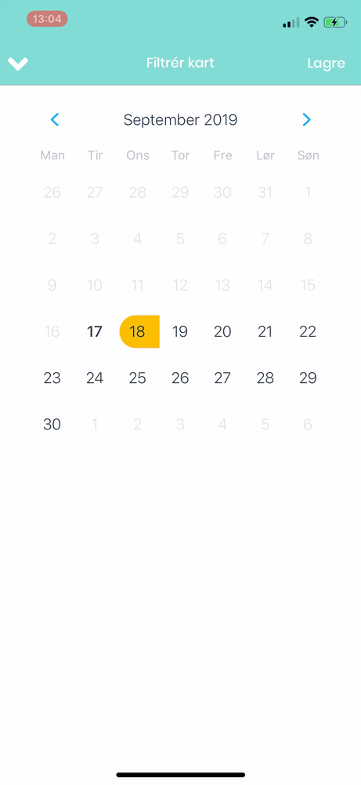

# React Native Date Range Picker

This is a simple snippet written on top of [`react-native-calendars`](https://github.com/wix/react-native-calendars) with [`hooks`](https://reactjs.org/docs/hooks-intro.html) and [`TypeScript`](https://www.typescriptlang.org/) inspired by [https://github.com/lazaronixon/react-native-date-range-picker](https://github.com/lazaronixon/react-native-date-range-picker).

It depends on [`date-fns`](https://date-fns.org/) and [`react-native-calendars`](https://github.com/wix/react-native-calendars)

First run
`yarn add date-fns react-native-calendars @types/react-native-calendars`

then just include [`date-range-picker.tsx`](date-range-picker.tsx) in your project and use it as below:

```javascript
import { addDays, addYears } from "date-fns";

...

<DateRangePicker
  initialRange={{from: new Date(), to: addDays(new Date(), 4)}}
  minDate={new Date()}
  maxDate={addYears(new Date(), 1)}
  onFromOnlySelected={(from: Date) => {
    console.warn(from);
  }}
  onFullRangeSelected={(range: IDateRange) => {
    console.warn(range);
  }}
  firstDay={1} //Sunday is 0, Monday is 1...
  width={"100%"} // style.width -> number | string
  color={"#00ff00"}
  textColor={"#000000"}
/>
```

Locale config is commented out in [`date-range-picker.tsx`](date-range-picker.tsx) so just comment in and change as needed.


